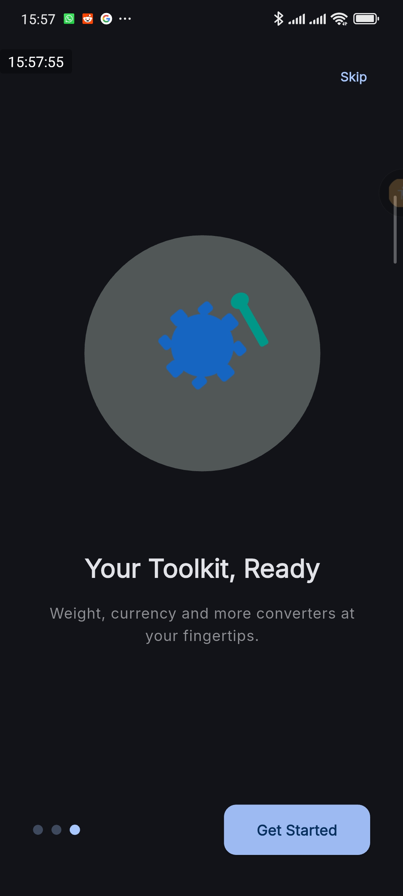
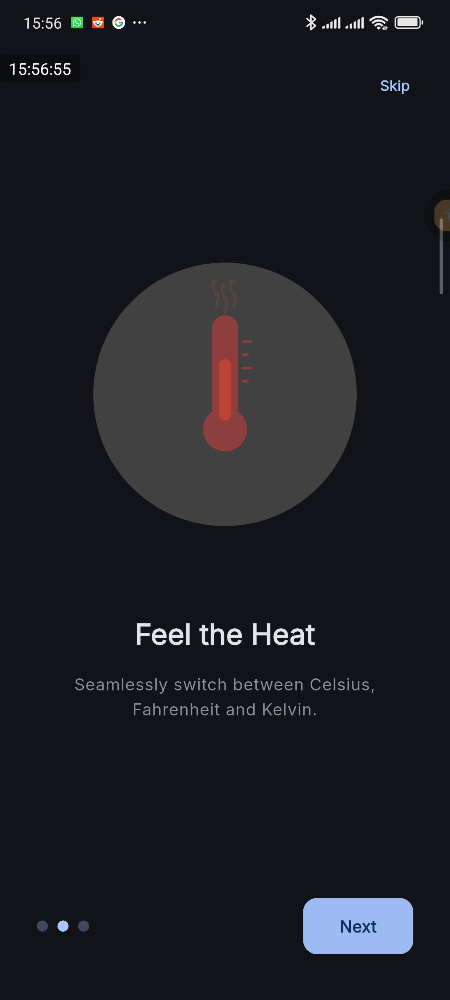
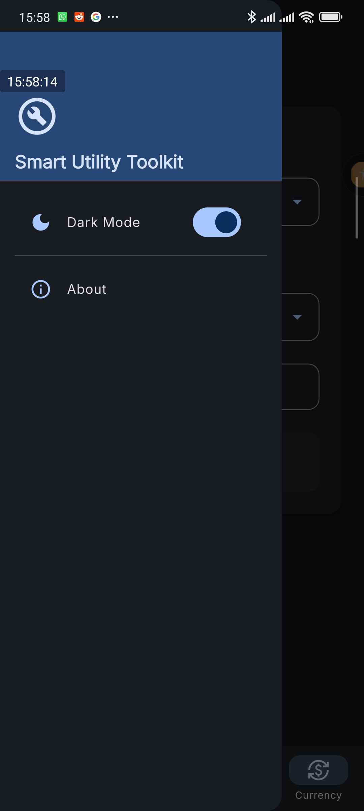
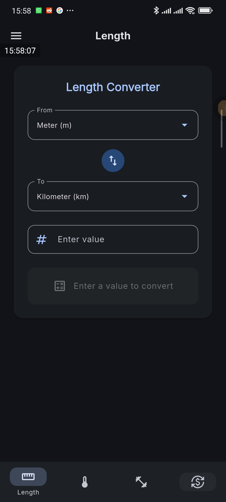
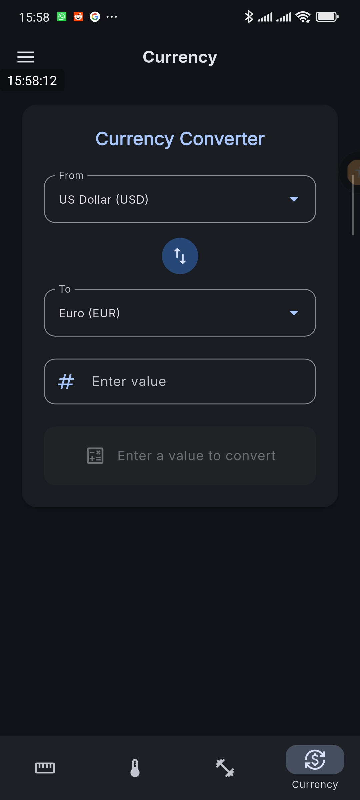

# Smart Utility Toolkit

A sleek, responsive Flutter mobile app that provides everyday unit conversion tools in a clean, modern interface.
HNG 14 mobile track stage 0 task

## Features

- **Length Converter** -- Convert between meters, kilometers, miles, feet, inches and more
- **Temperature Converter** -- Switch between Celsius, Fahrenheit and Kelvin
- **Weight Converter** -- Convert kilograms, grams, pounds, ounces and metric tons
- **Currency Converter** -- Convert between 9 major currencies (USD, EUR, GBP, JPY, NGN, CAD, AUD, INR, CNY) with dummy exchange rates
- **Dark & Light Themes** -- Toggle between themes via the navigation drawer, with preference persistence

## Screenshots







## Tech Stack

- **Flutter** (Dart SDK ^3.11.3)

## Packages

- **Provider** -- State management for theming
- **Lottie** -- Onboarding animations
- **Google Fonts** -- Font management
- **Smooth Page Indicator** -- Onboarding page dots
- **SharedPreferences** -- Theme preference persistence
- **URL Launcher** -- External link handling
- **Material 3** -- Modern design system with

## Getting Started

### Prerequisites

- Flutter SDK (stable channel)
- Android Studio / VS Code with Flutter extensions
- An Android emulator or physical device

### Installation

1. Clone the repository:

   ```bash
   git clone https://github.com/Moluno-xiii/smart-utility-toolkit-hng-14-mobile-stage-0.git
   cd smart-utility-toolkit-hng-14-mobile-stage-0
   ```

2. Install dependencies:

   ```bash
   flutter pub get
   ```

3. Run the app:
   ```bash
   flutter run
   ```

## APK Download

[Appetize Link](https://appetize.io/app/b_ldzplfgx466ctjvlfz3qklzrzi)

## Built as a requirement for the HNG 14 Mobile track stage 0 task
